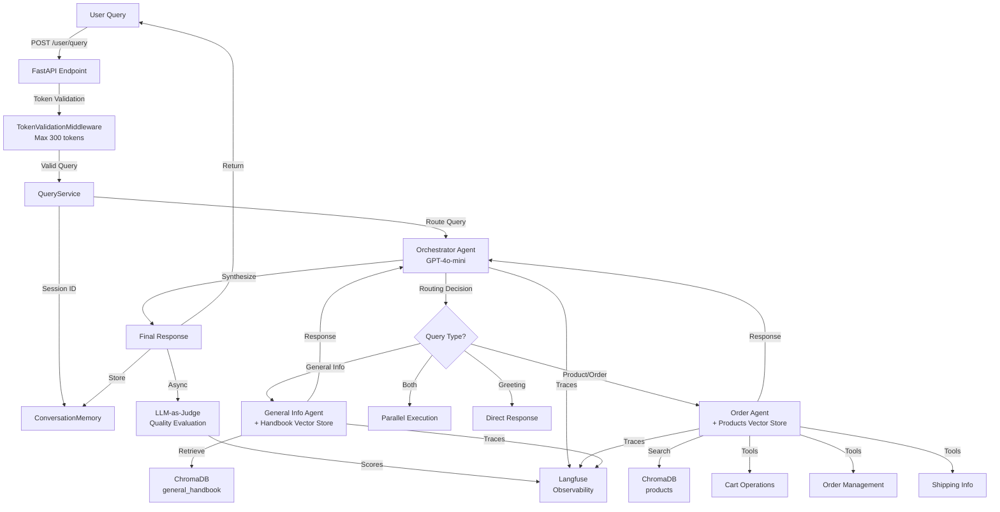

# Agentic Ecommerce Platform - Technical Report

## System Architecture Overview

### High-Level Flow Diagram



### System Components

```
┌─────────────────────────────────────────────────────────────┐
│                    FastAPI Application                       │
├─────────────────────────────────────────────────────────────┤
│  • Token Validation Middleware (tiktoken, 300 tokens)       │
│  • Rate Limiting (slowapi)                                   │
│  • CORS Middleware                                           │
└─────────────────────────────────────────────────────────────┘
                            │
                            ▼
┌─────────────────────────────────────────────────────────────┐
│                    Query Service Layer                      │
├─────────────────────────────────────────────────────────────┤
│  • Session Management (IP-based)                             │
│  • Conversation Memory (last 10 queries)                     │
│  • Orchestrator Agent Coordination                           │
└─────────────────────────────────────────────────────────────┘
                            │
                            ▼
┌─────────────────────────────────────────────────────────────┐
│                  Orchestrator Agent                          │
│              (Supervisor/LLM Router)                         │
├─────────────────────────────────────────────────────────────┤
│  Routing Modes:                                              │
│  • Single: One agent handles query                          │
│  • Sequential: Multiple calls to same agent                 │
│  • Parallel: Multiple agents in parallel                     │
│  • Direct: Greetings (no routing)                           │
└─────────────────────────────────────────────────────────────┘
                            │
            ┌───────────────┴───────────────┐
            ▼                               ▼
┌──────────────────────┐      ┌──────────────────────┐
│  General Info Agent  │      │    Order Agent        │
├──────────────────────┤      ├──────────────────────┤
│ Tools:               │      │ Tools:                │
│ • retrieve_handbook  │      │ • search_products    │
│                      │      │ • add_to_cart         │
│ Vector Store:        │      │ • edit_item_in_cart   │
│ • general_handbook   │      │ • remove_from_cart   │
│                      │      │ • view_cart           │
│                      │      │ • get_shipping_info   │
│                      │      │ • create_shipping_info│
│                      │      │ • edit_shipping_info  │
│                      │      │ • get_orders         │
│                      │      │ • purchase           │
│                      │      │                      │
│                      │      │ Vector Store:        │
│                      │      │ • products           │
└──────────────────────┘      └──────────────────────┘
```

---

## Orchestrator Agent

### Architecture

The Orchestrator Agent is a **supervisor agent** that uses LLM function calling to intelligently route user queries to specialized sub-agents.

#### Components


#### Key Features

1. **LLM-Based Routing**: Uses OpenAI function calling with two routing functions:
   - `query_general_info`: Routes to General Info Agent
   - `query_order_agent`: Routes to Order Agent

2. **Routing Modes**:
   - **Single**: One agent handles the query
   - **Sequential**: Multiple calls to the same agent (e.g., search then add to cart)
   - **Parallel**: Different agents called simultaneously (e.g., general info + product search)
   - **Direct**: Greetings handled directly without routing

3. **Tool Call Collapsing**: Multiple `query_order_agent` calls are collapsed into one using the original query to prevent unnecessary splits.

4. **Response Synthesis**: After sub-agents respond, orchestrator synthesizes a final user-friendly response.

5. **Memory Management**: Stores only product sources (with `product_id`) in conversation memory for order agent context, excluding handbook sources.

#### System Prompt Strategy

```
"You are Shoplytic's orchestrator agent. Your ONLY job is to route user queries 
to the appropriate sub-agent. You MUST ALWAYS call a routing function - you NEVER 
answer questions directly except greetings."
```

---

## Sub-Agents

### General Info Agent

**Purpose**: Answers questions about company policies, FAQs, shipping/returns, and general information.

#### Architecture

```
User Query → General Info Agent → retrieve_handbook_info → ChromaDB (general_handbook)
                                                          ↓
                                    Retrieved Context → LLM → Response
```

#### Tools

| Tool | Description |
|------|-------------|
| `retrieve_handbook_info` | Semantic search in handbook vector store (k=3, min_similarity=0.75) |

#### Execution Flow

1. **Direct Retrieval**: No initial LLM call needed (single tool)
2. **Vector Search**: Searches `general_handbook` collection in ChromaDB
3. **Context Injection**: Retrieved content injected into user message
4. **Response Generation**: LLM generates response with context

---

### Order Agent

**Purpose**: Handles product search, cart operations, shipping info, and order completion.

#### Architecture


#### Tools

| Tool | Description | Execution |
|------|-------------|-----------|
| `search_products` | Semantic product search with filters (category, brand, price, featured) | Vector store + post-filtering |
| `add_to_cart` | Add product to cart | In-memory cart manager |
| `edit_item_in_cart` | Update item quantity | In-memory cart manager |
| `remove_from_cart` | Remove item from cart | In-memory cart manager |
| `view_cart` | Get cart summary | In-memory cart manager |
| `get_shipping_info` | Retrieve shipping information | Database (thread pool) |
| `create_shipping_info` | Create shipping information | Database (thread pool) |
| `edit_shipping_info` | Update shipping information | Database (thread pool) |
| `get_orders` | Get orders (by ID or 5 most recent) | Database (thread pool) |
| `purchase` | Complete purchase with voucher | Database (thread pool) |

#### Execution Model

**Loop-Based Execution** (max 6 steps):
1. LLM decides: call tool OR return response
2. If tool call: execute tool, add result to messages
3. Repeat until no tool calls or max steps reached

**Key Constraints**:
- **One tool per step**: Enforced by system prompt
- **No duplicate calls**: Same function + args detected and rejected
- **State checking**: Always use tools to check state (never assume)

#### Natural Language Filter Extraction

The `search_products` tool extracts filters from natural language:

| User Query Pattern | Extracted Filter |
|-------------------|------------------|
| "below $100", "under $50", "cheap" | `max_price` |
| "above $200", "premium", "high-end" | `min_price` |
| "laptops", "phones", "watches" | `category: Electronics` |
| "shoes", "clothes" | `category: Clothing` |
| "headphones" | `category: Accessories` |
| "featured", "popular", "best sellers" | `is_featured: true` |
| Brand names (Apple, Nike, etc.) | `brand` |

**Category Mapping**:
- Laptops/Phones/Watches/Smartwatch → Electronics
- Shoes/Clothes → Clothing  
- Headphones → Accessories

---

## Technical Implementation Details

### 1. Indexing Pipeline

#### Database to Vector Store


**Key Design Decisions**:
- ✅ **Selective Indexing**: Only properties needed for semantic search are indexed
- ✅ **Exclude Volatile Data**: `stock_quantity` excluded (fetched from DB after search)
- ✅ **Structured Metadata**: Price, category, brand stored as metadata for filtering
- ✅ **Rebuild Strategy**: Full rebuild on `build_index.py` (admin changes trigger rebuild)

#### Chunking Strategy

**Products**: `RecursiveCharacterTextSplitter`
- Chunk size: 1000 characters
- Overlap: 200 characters
- Separators: `\n\n`, `\n`, `. `, ` `, `""`

**Handbook**: `MarkdownHeaderTextSplitter`
- Splits by headers (`#`, `##`, `###`)
- Preserves header hierarchy in metadata

### 2. Embedding Choice: OpenAI

**Decision**: Use OpenAI `text-embedding-ada-002` instead of local models.

**Rationale**:
- ✅ **Cost-Effective**: ~$0.0001 per 1K tokens (very reasonable)
- ✅ **Server Constraints**: Limited compute resources (no GPU)
- ✅ **API Performance**: Fast, reliable, outperforms local models on limited hardware
- ✅ **Consistency**: Same embeddings across environments

### 3. Vector Database Operations

**Non-Blocking Execution**:
- Vector store operations wrapped in `asyncio.to_thread()` to prevent blocking event loop
- ChromaDB operations run in thread pool executor

**Implementation**:
```python
# Vector search executed in thread pool
results = await asyncio.to_thread(
    vectorstore.similarity_search_with_score,
    query, k
)
```

### 4. Database Operations

**Thread Pool Wrapping**:
- All blocking DB operations use `run_db_operation_with_timeout()`
- Wraps SQLAlchemy operations in `asyncio.to_thread()`
- Timeout: 5 seconds (15s for purchase)

**Connection Retry**:
- Up to 3 retries on `OperationalError`
- 1 second delay between retries
- Connection tested with `SELECT 1` before use

### 5. Routing Modes

| Mode | Description | Example |
|------|-------------|---------|
| **Single** | One agent handles query | "Show me laptops" → Order Agent only |
| **Sequential** | Multiple calls to same agent | "Search laptops, then add to cart" → Order Agent (2 steps) |
| **Parallel** | Different agents simultaneously | "What's your return policy and show me phones" → General Info + Order Agent |
| **Direct** | No routing (greetings) | "Hello" → Direct response |

### 6. Natural Language Filter Extraction

**Implementation**: LLM extracts filters from user queries in `search_products` tool.

**Examples**:
- "products below $100" → `max_price: 100`
- "show me featured laptops" → `category: Electronics`, `is_featured: true`
- "cheap headphones" → `category: Accessories`, `max_price: 50` (inferred)

**Post-Filtering**: Price filters applied after vector search (ChromaDB doesn't support range queries).

### 7. Evaluation: LLM-as-Judge

**Architecture**:


**Quality Dimensions** (each scored 1-10):
1. **Relevance**: How relevant to user query?
2. **Accuracy**: Factually correct?
3. **Completeness**: Fully addresses request?
4. **Clarity**: Clear and understandable?
5. **Helpfulness**: Helps achieve user goal?

**Execution**: 
- ✅ **Non-blocking**: Runs asynchronously via `asyncio.create_task()`
- ✅ **No delay**: Doesn't affect response time
- ✅ **Langfuse Integration**: Scores attached to trace ID

### 8. Deduplication & Idempotency

**Tool Call Deduplication**:
- Order Agent enforces: no duplicate tool calls with identical function + args
- Detected by signature: `(function_name, json.dumps(args, sort_keys=True))`

**Idempotent Operations**:
- **Purchase**: Checks if order already exists (by voucher code in orders table)
- **Cart Operations**: Atomic operations (check-and-modify in one step)
- **Shipping Info**: Partial updates supported (only provided fields updated)

### 9. Rate Limiting

**Implementation**: `slowapi` with IP-based limiting
- Default: 60 requests per minute per IP
- Configurable via `RATE_LIMIT_ENABLED` and `RATE_LIMIT_PER_MINUTE`
- Exception handler returns 429 status code

### 10. Token Validation

**Middleware**: `TokenValidationMiddleware`
- Validates queries to `/user/query` endpoint
- Max tokens: 300 (using `tiktoken` with `cl100k_base` encoding)
- Returns 400 error if exceeded
- Prevents long queries from reaching orchestrator

### 11. Langfuse Integration

**Observability Stack**:


**Features**:
- ✅ **Tracing**: Full query lifecycle traced
- ✅ **Spans**: Orchestrator, agents, tools
- ✅ **Scores**: LLM-as-Judge evaluation scores
- ✅ **Environment**: Configurable via `LANGFUSE_BASE_URL`, `LANGFUSE_PUBLIC_KEY`, `LANGFUSE_SECRET_KEY`

**Integration**: Uses `langfuse.openai.AsyncOpenAI` drop-in replacement for automatic tracing.

### 12. Golden Dataset Testing

**Infrastructure**:
- Test cases: `data/golden_data/test_cases.json`
- Test runner: `tests/test_runner.py`
- Categories: `product_search`, `cart_operations`, `general_info`, `checkout`, `shipping`, `orders`, `voucher`, `compound_query`, `conversation`

**Usage**:
```bash
# Run all tests
python -m tests.test_runner

# Run by category
python -m tests.test_runner --category cart_operations

# Run single test
python -m tests.test_runner --id product_search_001

# Save results
python -m tests.test_runner --save
```

**Test Case Format**:
```json
{
  "id": "product_search_001",
  "category": "product_search",
  "query": "Show me some laptops",
  "expected_agent": "order",
  "expected_behavior": "Should search for laptops and return product results",
  "min_quality_score": 7
}
```

**Test Case Coverage** (17 test cases):

| Category | Test Cases | Expected Behavior |
|----------|------------|-------------------|
| **Product Search** | 3 tests | Search products with filters (category, price), return results |
| **Cart Operations** | 3 tests | Add, view, remove items from cart |
| **General Info** | 3 tests | Answer policy questions (returns, shipping, free shipping) |
| **Checkout** | 1 test | Initiate checkout flow, collect shipping info |
| **Shipping** | 1 test | Update shipping address |
| **Orders** | 1 test | Retrieve and display order history |
| **Voucher** | 1 test | Generate voucher codes |
| **Compound Query** | 1 test | Handle multiple operations (add multiple items) |
| **Conversation** | 1 test | Direct greeting without routing |

**Example Test Cases**:

1. **product_search_001**: "Show me some laptops"
   - Expected: Order agent searches Electronics category, returns laptop products

2. **product_search_002**: "I'm looking for a watch under $300"
   - Expected: Order agent searches Electronics (watches), applies `max_price: 300` filter

3. **cart_add_001**: "Add iPhone 15 Pro Max to my cart"
   - Expected: Order agent searches for product, adds to cart, confirms addition

4. **policy_001**: "What is your return policy?"
   - Expected: General Info agent retrieves return policy from handbook, provides answer

5. **greeting_001**: "Hello!"
   - Expected: Orchestrator responds directly (no agent routing), friendly greeting

**Test Runner Output**:
- Validates `status_code == 200`
- Checks `agents_used` matches `expected_agent`
- Measures `response_time_seconds`
- Generates report with pass/fail rates, category breakdown, average response time

---

## Performance Optimizations

### 1. Vector Store Pre-loading
- Vector stores initialized at application startup
- Stored in `app.state` for reuse across requests
- Avoids initialization delay on first query

### 2. Async/Non-Blocking Operations
- All I/O operations are async (LLM calls, vector search, DB operations)
- Blocking operations wrapped in thread pool (`asyncio.to_thread()`)
- Event loop never blocked

### 3. LLM Parameter Optimization
- Default `temperature: 0.0` (deterministic)
- Default `top_p: 1.0` (full vocabulary)
- Consistent across all agents via `src/config.py`

### 4. Connection Pooling
- SQLAlchemy connection pool: `pool_size=10`, `max_overflow=20`
- `pool_pre_ping=True` for connection health checks

---

## API Endpoints

### User Endpoints

| Endpoint | Method | Description |
|----------|--------|-------------|
| `/user/query` | POST | Process query through multi-agent system |
| `/user/vouchers/generate` | POST | Generate $2000 voucher code |
| `/user/cart` | GET | Get shopping cart |
| `/user/orders` | GET | Get user orders (with shipping address) |
| `/user/products` | GET | Search/filter products (pagination) |
| `/user/products/featured` | GET | Get featured products |
| `/user/products/{product_id}` | GET | Get product by ID |

### Admin Endpoints

| Endpoint | Method | Description |
|----------|--------|-------------|
| `/admin/products/` | POST | Create product |
| `/admin/products/` | GET | List products (filters) |
| `/admin/products/{product_id}` | GET | Get product by ID |
| `/admin/products/sku/{sku}` | GET | Get product by SKU |
| `/admin/products/{product_id}` | PUT | Update product |
| `/admin/products/{product_id}` | PATCH | Partially update product |

---

## Deployment & Documentation

### Deployment
- **Platform**: Render.com
- **Database**: Neon PostgreSQL (free tier)
- **Status**: [UptimeRobot](https://stats.uptimerobot.com/5z2EBCHShQ)

### Documentation
- **API Docs**: `/docs` (Swagger UI)
- **Alternative**: `/redoc`
- **Live Demo**: [Frontend](https://agentic-ecommerce-fe.vercel.app/)

---

## Summary

This agentic ecommerce platform demonstrates:

✅ **Multi-agent architecture** with intelligent routing  
✅ **Semantic search** with selective indexing  
✅ **Natural language understanding** for filter extraction  
✅ **Non-blocking I/O** for optimal performance  
✅ **Comprehensive observability** with Langfuse  
✅ **Quality evaluation** via LLM-as-Judge  
✅ **Production-ready** with rate limiting, validation, and error handling  

The system successfully handles complex ecommerce queries through specialized agents while maintaining conversation context and providing high-quality responses.
